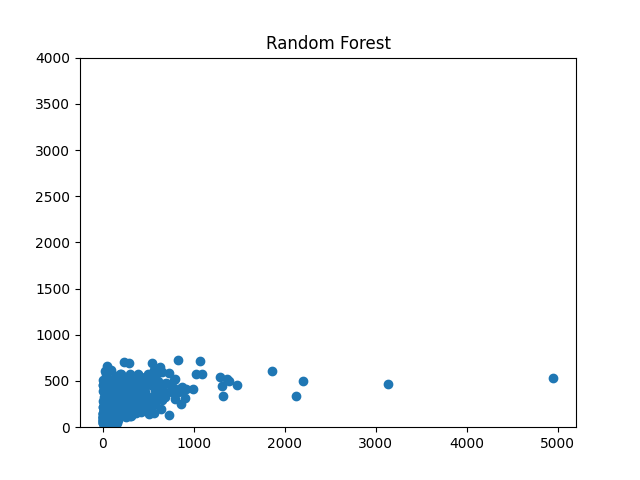
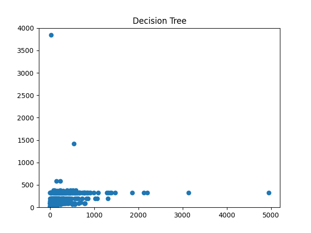
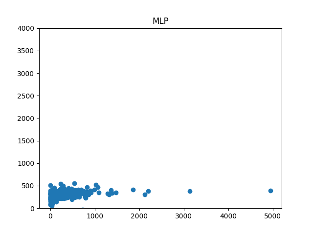
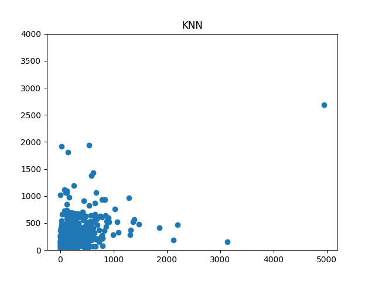
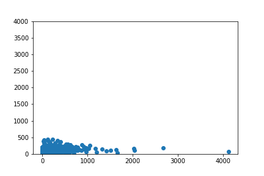

## SocialSigNet

### Files:
1) working.py: code to create social signatures
2) createFootprints.py: code to create images of each row in us_migration.csv based on trained weights from working.py
3) resnsetWorking.py: uses slightly modified resnset18 archtiecture to train model based on social signature images created in createFootprints.py
4) nn_dt_rf_knn.py: Trains traditional models for comparison to socialSig

### Helper Files:
a) helpers.py: ssorted helper functions used throughout all files
b) resnet18.py: Architecture used to train model on socialSig footprint images (TODO: Make responsive to user input sizes)
c) socialSig.py: Architecture used to train model for creating socialSigs

 
 

### Current Results

|       Model	    |        MAE	 |     MAPE	    |          R2	     |   Quantity Error	|  Allocation Error
|-------------------|----------------|--------------|--------------------|------------------|--------------------
| socialSigNet	    |   215.1286552	 |  1.48E+16	|   -0.1594528512	 |   54721.64644	|    118.960101
| Decision Tree	    |   193.0494624	 |  9.76E+17	|    0.1808922845	 |   34610	        |    74.43010753
| KNN	            |   261.388172	 |  2.41E+18	|    0.03378865814	 |   18915.5	    |    40.67849462
| Random Forest	    |   208.8401289	 |  1.55E+18	|    0.1880718695	 |   2935.635962	|    6.313195617
| Neural Network	|   233.4912048	 |  3.27E+16	|    0.09794770185	 |   3512.248738	|    7.553223093

 
 

### Model Plots

#### Random Forest

#### Decision Tree

#### MLP

#### KNN

#### socialSig
